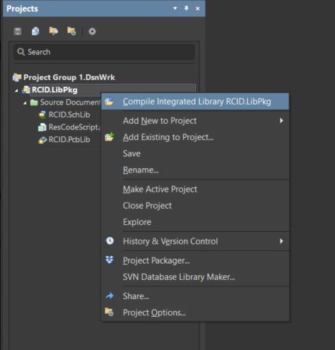

# Altium-Fancy-Parts-RCID
## SMD Resistor code generator

**Automatically generate standard SMD resistor codes (EIA-24, EIA-96) from resistance values in Altium Designer.**  

This script simplifies PCB design by converting:  
- **Numeric values** (e.g., `120`, `2.2`) → **3/4-digit codes** (e.g., `121`, `2R2`)  
- **Tolerance-aware** (default: 5%, supports 1% for EIA-96)  
- **Handles units** (Ω, R, K, M) and **variant notations** (e.g., `2K8` = `2.8K` → `282`)  

Perfect for:  
✔️ Avoiding manual lookup tables  
✔️ Ensuring standardized markings  
✔️ Supporting both EIA-24 (e.g., `102`) and EIA-96 (e.g., `01C`) formats  

---
### Installation
Simply compile LibPkg project and don't move the folder location.

### Usage
1. Add resistance to Value parameter of resistor
2. Modify Tolerance (default is 5%)
3. Modify EIA-96 mode (0 or 1)

Then go to `File->RunScript...` and use `Browse...` button for `ResCodeScript.pas` if not opened in Projects.

### Some examples:
| Input      | Output |
|------------|--------|
| 120        | 121    |
| 120R       | 121    |
| 120Ω       | 121    |
| 2.2        | 2R2    |
| 0.005      | R005   |
| 2.8K       | 282    |
| 2K8        | 282    |
| 2.8KΩ      | 282    |
| 2.8K(1%)   | 3301   |
| 2.8K(EIA-96 = 1) | 44B |

### Tutorial video
▶️ [Watch Tutorial](https://www.youtube.com/watch?v=o0m7egEYXtE)
